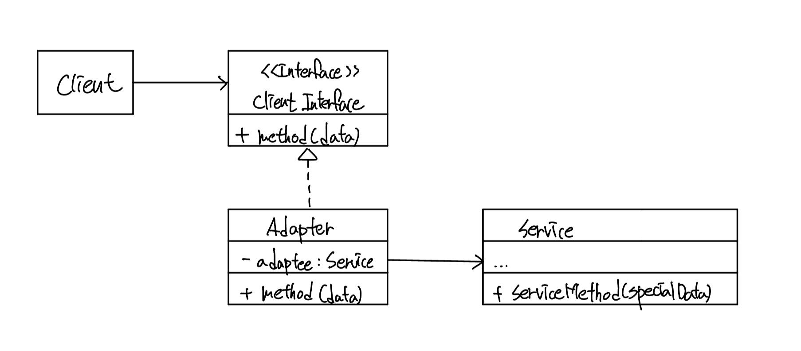
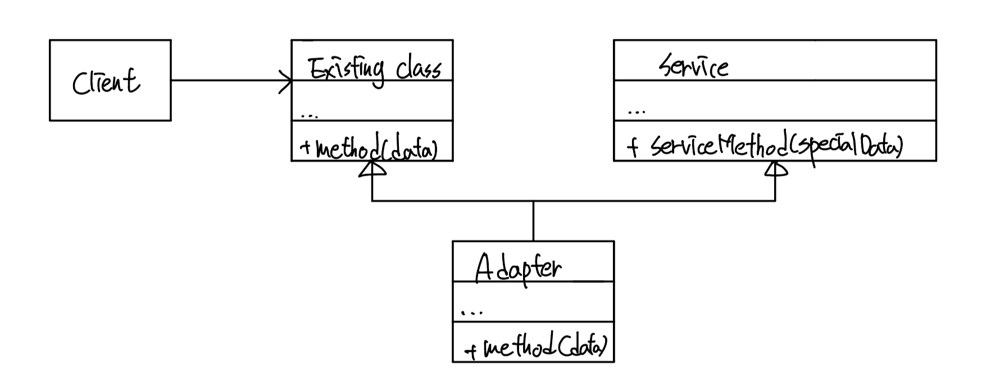

# Adapter Pattern
## 의도
어댑터 패터는 서로 다른 인터페이스를 가지고 있는 객체가 상호작용 할 수 있도록 해준다.

일본에 놀러갈 때는 110V에 220V를 연결할 수 있도록 어뎁터를 챙겨가야한다.

## 구조
### Object Adapter

오즈벡트 어댑터는 객체 구성 원칙을 사용한다. 어댑터는 인터페이스를 구현하여 사용된다.

- 클라이언트는 프로그램의 비즈니스 로직을 가지고 있다.
- 클라이언트 인터페이스는 프로토콜을 표시하고 구현체는 해당 프로토콜을 따라야한다.
- 클라이언트는 인터페이스가 달라서 직접적으로 서비스로 요청을 보낼 수 없다.
- 어뎁터는 클래스 인터페이스의 구현체이고 클라이언트와 서비스를 연결해준다.
- 클라이언트는 어댑터와 커플링되어있지 않아 다른 코드 수정없이 어댑터만 교체해 줄 수 있다.

### Class Adaper

C++처럼 다중 상속을 지원하는 언어에서 사용할 수 있다. 어댑터는 현재 클래스와 서비스를 모두 상속받아서 기능을 연결해주는 기능을 구현하여 현재 클래스를 대체한다.

## 목적
- 어댑터는 이전에 구현된 객체가 다른 객체의 인터페이스가 맞지 않는 경우 사용된다.
- 어댑터 패턴은 중간에서 번역기 역할을 한다.

## 장단점
### 장점
- 단일 책임 원칙을 따른다.
- 개방 폐쇄 원칙을 따른다.

### 단점
- 코드 복잡도가 증가한다.

## 다른 패턴과 관계
- Bridge: 브릿지 패턴은 일반적으로 미리 디자인된 객체를 독립적으로 개발할 수 있게 해주지만 어댑터는 미리 개발된 호환되지 않는 객체를 연결하는 역할을 한다.
- Decorator: 데코레이터는 인터페이스를 변경하지 않고 기능을 추가하지만 어댑터는 존재하는 오브젝트의 인터페이스를 바꿔야한다. 또한 데코레이터는 재귀적으로 구성할 수 있다.
- 어댑터는 다른 인터페이스를 감싼 객체에 재공하지만 프록시는 같은 인터페이스를 제공하고 데코레이터는 향상된 인터페이스를 제공한다.